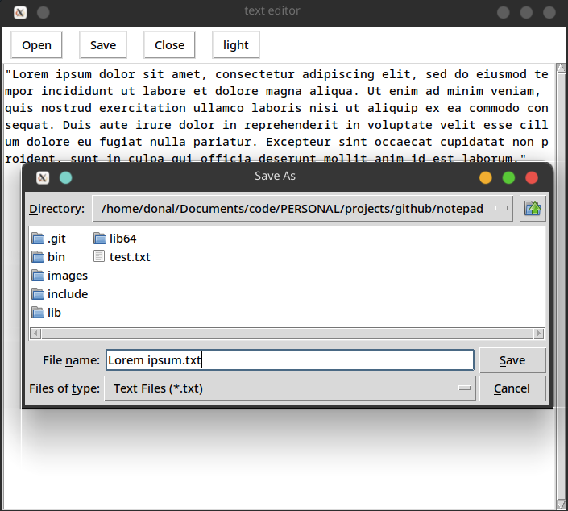
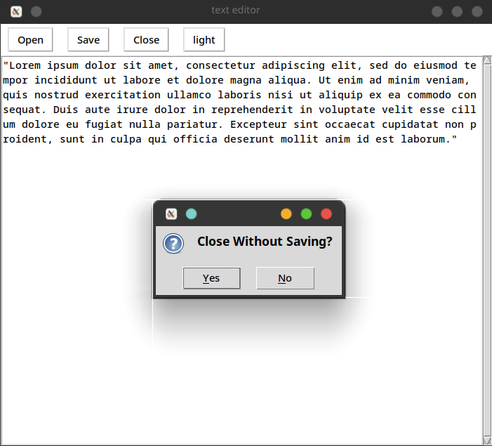
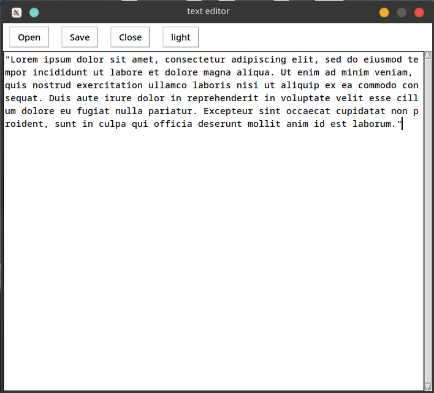
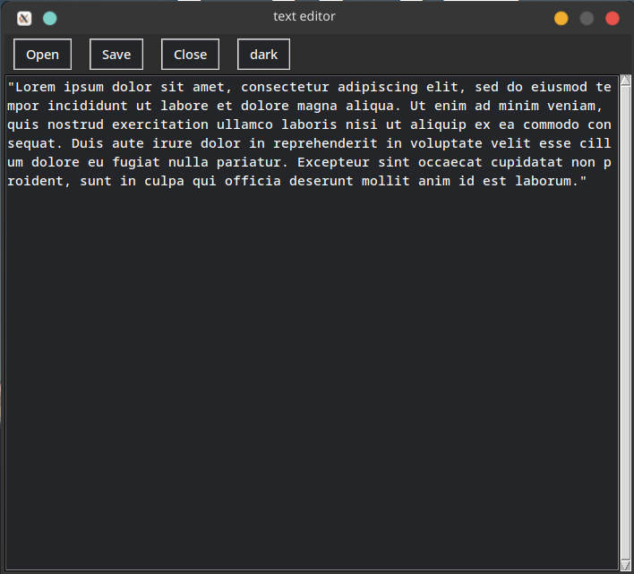

# Text editor made in python 
A small program to create a text editor in python with a GUI 
- the program relies on a python library called Tkinter for the bulk of the GUI
- can be use to edit files of any extension
- opens & closes files
- can save files to device
- option betwwen light and dark mode

# file dialouuge 

i made use of the "filedialouge" library which is part of tkinter to allow me to prompt the user where to save / open files 

## open 
 
- prompts the user to be able to open previously written files or projects
- it opens the project in the current window

## save 
 
- allows the user to save their work 

## close 
 
- if the user hasnt saved the program will ask if the user wants to quit **without saving** 

# light mode 

- default mode is light mode but there is a button to allow the user to change it 

# dark mode 

- when the light mode button is pressed the theme changes to dark and can be pressed again to change back 
